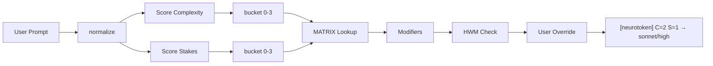

# Neurotoken

[](https://github.com/jeffmichaeljohnson-tech/neurotoken/actions/workflows/test.yml)

Adaptive thinking allocation for Claude Code.

Neurotoken is a zero-dependency prompt scoring engine that classifies every Claude Code prompt on two independent axes — **complexity** (reasoning difficulty) and **stakes** (impact of a wrong answer) — and recommends one of 11 model/effort tiers from `haiku/low` to `opus/max`. It runs as a [UserPromptSubmit hook](https://docs.anthropic.com/en/docs/claude-code/hooks) in under 100ms with no external dependencies.

## The Adaptive Matrix

Every prompt maps to a cell in this 4x4 matrix:

| | S=0 (Routine) | S=1 (Moderate) | S=2 (High) | S=3 (Critical) |
|---|---|---|---|---|
| **C=0** (Trivial) | haiku/low | haiku/med | sonnet/med | opus/med |
| **C=1** (Low) | haiku/med | sonnet/med | sonnet/high | opus/med |
| **C=2** (Medium) | sonnet/med | sonnet/high | opus/med | opus/high |
| **C=3** (High) | opus/med | opus/med | opus/high | opus/max |

The matrix is intentionally asymmetric: high stakes with low complexity still routes to opus, because getting a simple thing wrong in production is worse than overthinking a hard question in a sandbox.

## How It Works



1. **Normalize** — lowercase, strip code fences/inline code, expand contractions, collapse whitespace
2. **Score** — match phrases (weight 4-5), keywords (weight 2), and weak keywords (weight 1) against signal dictionaries. Apply structural bonuses for multi-file references, concept density, and multi-step instructions.
3. **Bucket** — raw scores map to 0-3 via thresholds `[2, 5, 9]`
4. **Matrix** — `MATRIX[complexity][stakes]` returns a tier index (0-10)
5. **Modifiers** — escalation (+auth, +deploy, +finance, +cross-project, +novel) capped at +2; de-escalation (-test, -docs, -format, -readonly) capped at -1
6. **HWM** — high-water mark prevents score collapse on follow-up prompts like "ok do it" after complex discussions. Time-proportional decay over 5 minutes.
7. **User Override** — phrases like "think harder" (+2) or "quick answer" (-1) bypass modifier caps

## Scoring Signals

### Complexity

- **Phrases** (+4 each): "system architecture", "design pattern", "state machine", "race condition", "distributed system", "database migration", "from scratch", and more
- **Keywords** (+2 each): "architect", "polymorphism", "graphql", "parser", "algorithm", "sharding", and more
- **Weak keywords** (+1 each): "interface", "async", "middleware", "proxy", "cache"
- **Structural bonuses**: multi-file references (+3), concept density in long prompts (+2), multi-step instructions (+1)

### Stakes

- **Phrases** (+5 each): "production database", "deploy to production", "rls policy", "authentication flow", "delete from", "push to main", and more
- **Keywords** (+2 each): "production", "security", "vulnerability", "encrypt", "stripe", "billing", and more
- **Weak keywords** (+1 each): "database", "token", "auth", "env", "migration", "main", "policy"
- **Context dampening**: "deploy" near "test"/"staging"/"sandbox" reduces stakes. "production" near "explain"/"about" reduces stakes.

### Modifiers

| Trigger | Shift | Condition |
|---|---|---|
| +auth | +1 | Auth/RLS keyword + mutating verb |
| +deploy | +1 | Deploy action + production target (without dampening) |
| +finance | +1 | Payment keyword + mutating verb |
| +cross-project | +1 | 2+ configured project names or "cross-project" phrase |
| +novel | +1 | "new architecture", "greenfield", "from scratch" |
| -test | -1 | Test keywords without production signals |
| -docs | -1 | Documentation keywords without mutating verbs |
| -format | -1 | Formatting keywords (prettier, eslint, lint) |
| -readonly | -1 | Read-only primary verb with no mutating context |

Escalation capped at +2, de-escalation capped at -1 (asymmetric safety bias).

### User Overrides

| Phrase | Shift |
|---|---|
| "think harder", "max effort", "ultrathink" | +2 |
| "think more", "go deeper", "be thorough" | +1 |
| "quick answer", "just tell me", "brief" | -1 |
| "think less", "fastest possible" | -2 |

## Installation

```bash
# Clone and run from the project root
git clone https://github.com/jeffmichaeljohnson-tech/neurotoken.git
cd neurotoken
./install.sh
```

The installer copies hook files to `~/.claude/hooks/` and the policy document to `~/.claude/`. After running, follow the printed instructions to add the hook to your `settings.json` and configure environment variables.

### Environment Variables

| Variable | Values | Default | Purpose |
|---|---|---|---|
| `NEUROTOKEN_MODE` | `shadow`, `active`, `active-ceiling`, `off` | `shadow` | Shadow logs without injecting; active injects recommendations; active-ceiling also permits downgrade (v1.1.0+) |
| `NEUROTOKEN_CEILING` | Tier name like `opus/max` | `opus/max` | In ceiling mode, the maximum tier the orchestrator may dispatch to |
| `NEUROTOKEN_SESSION` | `A`, `B`, etc. | `?` | Tags log entries for A/B testing |
| `NEUROTOKEN_PROJECTS` | Comma-separated names | (empty) | Project names for +cross-project modifier detection |

Start with `NEUROTOKEN_MODE=shadow` to validate scoring before activating.

## Ceiling-Rule Mode (v1.1.0+)

The default mode is safety-first: Neurotoken only escalates, never downgrades. If you want **cost optimization** — set your global model to Opus and let Neurotoken route low-complexity work to Haiku/Sonnet — opt into `active-ceiling` mode.

```bash
# In settings.json env
NEUROTOKEN_MODE=active-ceiling
NEUROTOKEN_CEILING=opus/max
```

In this mode, when the scored tier is safely below the ceiling AND none of the safety guards fire, the annotation includes an explicit downgrade permission:

```
[neurotoken] C=0 S=0 → haiku/low (downgrade OK from opus/max)
```

Your orchestrator agent reads this and dispatches to a lower-tier subagent. **Downgrade is blocked** when any of these fire: `+auth`, `+deploy`, `+finance`, `+cross-project`, or `S=3`. In those cases the annotation omits the downgrade suffix and behaves like floor-rule mode. See `docs/ADR-001-ceiling-rule.md` for the full design rationale.

## Testing

```bash
npm test
```

183 tests across 29 suites covering bucket math, matrix constants, scoring, verb detection, context dampening, modifiers, user overrides, edge cases, HWM integration, imperative-extraction patterns, ceiling-mode semantics, and adversarial safety-modifier detection. Zero external dependencies — uses Node.js built-in test runner.

## Architecture

```
neurotoken/
  src/
    neurotoken-scorer.mjs       # Main hook — reads stdin, scores, emits recommendation
    neurotoken-grader.mjs       # A/B test grading script
    lib/
      neurotoken-signals.mjs    # Signal definitions, matrix, scoring functions
      normalize.mjs             # Text normalization (shared with other hooks)
  tests/
    test-scoring.mjs              # 57 unit tests
    test-edge-cases.mjs           # 52 edge case + regression tests
    test-hwm-integration.mjs      # 13 subprocess tests for HWM path
    test-extraction-patterns.mjs  # 15 tests for imperative-extraction scoring
    test-ceiling-mode.mjs         # 9 tests for active-ceiling semantics
    test-safety-modifiers.mjs     # 36 adversarial tests for safety-guard modifiers
  docs/
    neurotokens.md                # Policy document for Claude to interpret recommendations
    orchestrator-patch.md         # Dispatch section for orchestrator agents
    ADR-001-ceiling-rule.md       # Design rationale for floor→ceiling opt-in shift
  CHANGELOG.md                    # Version history
  install.sh                      # Deployment script
```

## Limitations

1. **Advisory only** — the hook injects text recommendations via `additionalContext`. It cannot programmatically change the running model or effort level. The real actuator path is orchestrator dispatch.
2. **Keyword-based** — classification uses pattern matching (~85-90% accurate). It does not understand semantic meaning.
3. **Code blocks** — fenced code and inline code are stripped before scoring, but code pasted without fences may inflate scores.
4. **Multi-turn decay** — the high-water mark decays over ~5 minutes with time-proportional reduction. Long pauses reset context entirely.

## License

[MIT](LICENSE)
